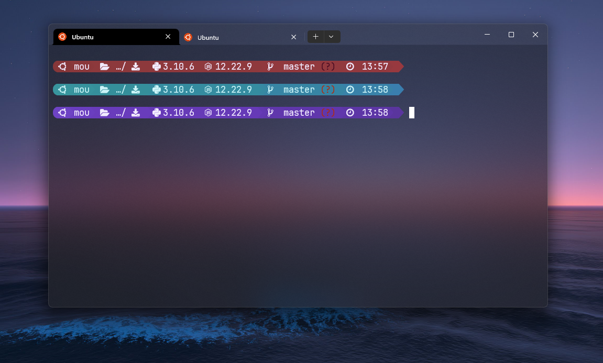
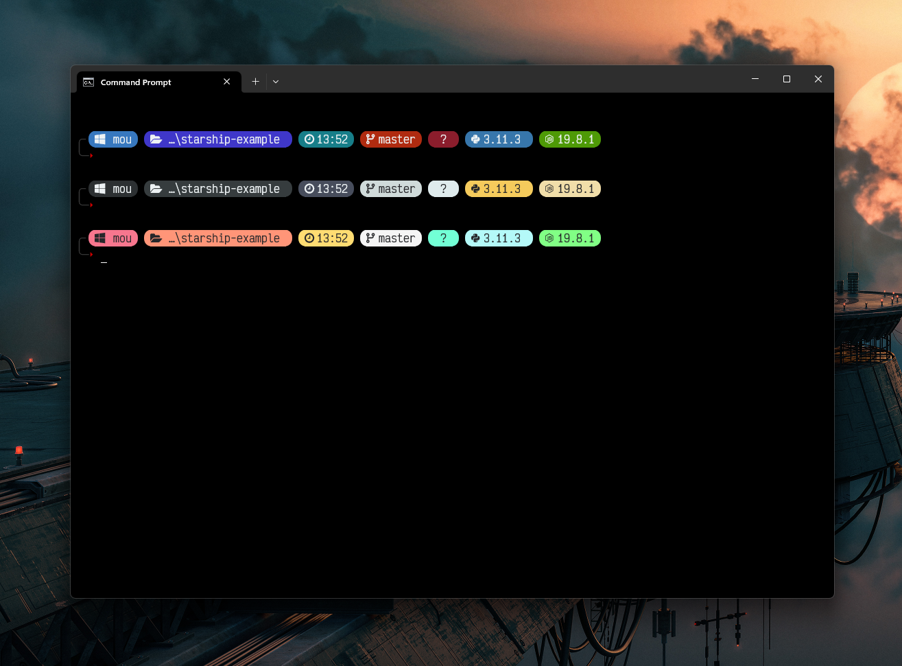
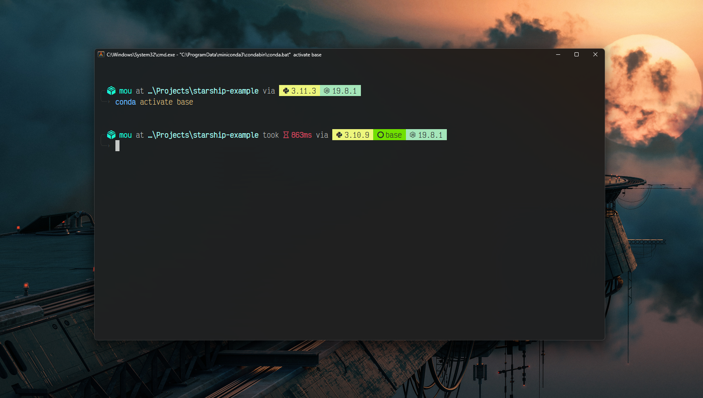

# Starship Prompt

This repository contains some starship presets.

To get started with Starship and to find the documentation, Go to the [official website](https://starship.rs/).

For icons and geometric shapes, use a Nerd Font (I personnaly use VictorMono (last preview image) or JetBrains Mono (First preview image)): https://www.nerdfonts.com/font-downloads

These presets are not fully configured, there are some modules that I didn't add because I don't use the corresponding tools or languages, you can use these presets as a starting point or inspiration, but keep in mind that you need to modify the toml file to add and configure the modules you need if it doesnt follow the same look of the preset, you can just add a color in the palette for that module (In case of pills preset), and add the closing and opening icons with their styles and colors like the other existing modules.

### Preview for Pastel Prompt:
___

### Preview for Pills Prompt:
___

### Preview for Text Prompt:
___

Some terminal emulators fail to render powerline icons (or some patched nerd fonts) so a vertical gap between the text and the icons will become visible, which annoyed me, so I made this preset with none of those icons, Alacritty is an example, but now there are no gaps.
