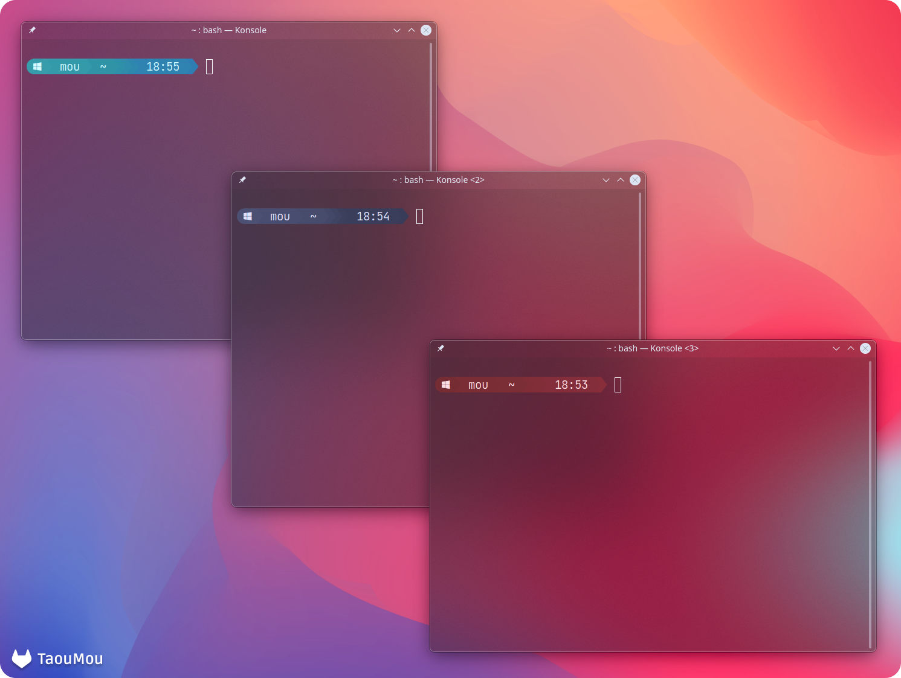

# Starship Prompt
This repository contains my starship presets configuration.

For Starship on Windows 10 using the Windows Terminal, this is the current configuration of my command prompt:

For icons and geometric shapes, use a Nerd Font (I personnaly use FiraCode or JetBrains Mono): https://www.nerdfonts.com/font-downloads

To set up the OS icon, create an environmental variable called STARSHIP_DISTRO and give it the icon of your OS as value. 
(How to find the icon of you OS: https://www.nerdfonts.com/cheat-sheet)

 | Colors | Hex Code | Colors | Hex Code | Colors | Hex Code
 | :---: | :---: | :---: | :---: | :---: | :---: |
 |  | `#5A5A79` |  | `#38959E` |  | `#873739` |
 |  | `#585877` |  | `#37929D` |  | `#8B383B` |
 |  | `#565674` |  | `#358F9B` |  | `#8D393C` |
 |  | `#535370` |  | `#358CA0` |  | `#8F393D` |
 |  | `#50506C` |  | `#3689A2` |  | `#91393E` |
 |  | `#4C4C66` |  | `#3785A4` |  | `#92393E` |
 |  | `#4A4A64` |  | `#3982A9` |  | `#93393F` |
 |  | `#484861` |  | `#3A7EAE` |  | `#98393F` |
# starship-preset
